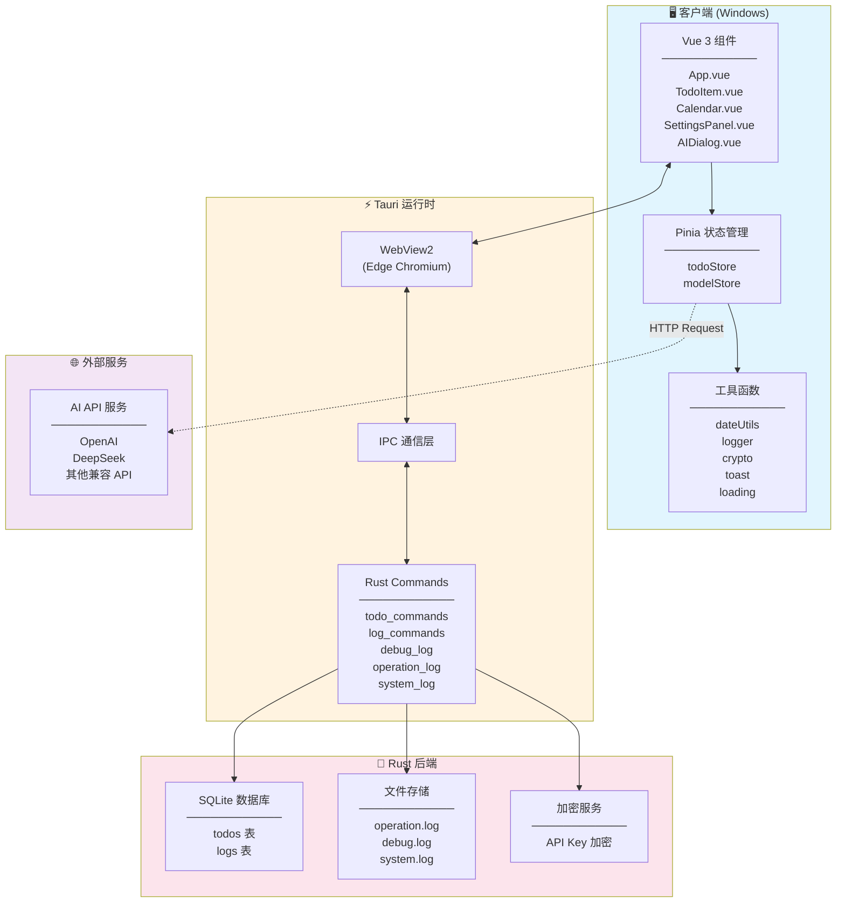
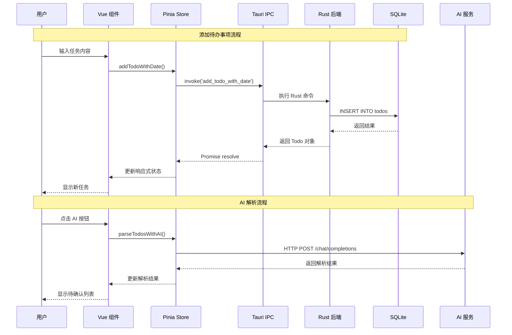
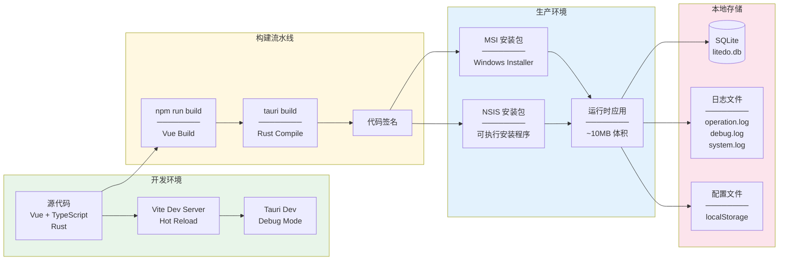

# LiteDo - 轻量级待办事项应用

<div align="center">


**简洁、高效的 Windows 桌面待办事项管理工具**

[](LICENSE)
[](https://github.com/yuuine/litedo/releases)
[](https://github.com/yuuine/litedo/releases)
[](https://tauri.app/)
[](https://vuejs.org/)

</div>

---

## 目录

- [功能特性](#-功能特性)
- [快速开始](#-快速开始)
- [技术栈](#-技术栈)
- [项目架构](#-项目架构)
- [项目结构](#-项目结构)
- [项目文档](#-项目文档)
- [更新日志](#-更新日志)
- [许可证](#-许可证)
- [致谢](#-致谢)

---

## ✨ 功能特性

### 核心功能

| 功能 | 描述 |
|------|------|
| 📝 **待办事项管理** | 快速添加、编辑、删除和完成任务，支持字数限制（10-200字） |
| 📅 **日期筛选** | 按日期查看任务，支持日历选择和日期导航 |
| 🎨 **主题自定义** | 9种预设主题色 + 自定义颜色选择器 |
| 🤖 **AI 智能解析** | 支持多种 AI 模型，自然语言解析待办事项 |
| ⚙️ **灵活配置** | 自定义待办事项字数限制、模型配置等 |

### AI 功能

- **多模型支持**：支持 OpenAI、DeepSeek 及其他兼容 API 的 AI 服务
- **自然语言解析**：输入自然语言描述，AI 自动解析为结构化待办事项
- **优先级识别**：自动识别任务优先级（高/中/低）
- **安全存储**：API 密钥本地加密存储

### 日志系统

| 日志类型 | 描述 | 文件 |
|---------|------|------|
| 📋 **操作日志** | 记录用户业务操作（添加、删除、完成任务等） | `operation.log` |
| 🐛 **调试日志** | 记录系统运行详情（JSON格式，结构化数据） | `debug.log` |
| 🎯 **系统日志** | 记录所有系统交互操作 | `system.log` |

### 其他功能

- 📊 **任务统计** - 实时显示任务完成情况（全部/待办/完成）
- 💾 **本地存储** - SQLite 数据库，数据安全可靠
- 🔒 **数据安全** - API 密钥加密存储

---

## 🚀 快速开始

### 环境要求

| 依赖 | 版本要求 | 说明 |
|------|---------|------|
| Node.js | >= 18.x | JavaScript 运行时 |
| Rust | >= 1.70 | 系统编程语言 |
| pnpm/npm/yarn | 最新版 | 包管理器 |

### 下载安装

前往 [Releases](https://github.com/yuuine/litedo/releases) 页面下载对应平台的安装包：

#### Windows

| 安装包 | 说明 |
|--------|------|
| `LiteDo_1.0.0_x64_en-US.msi` | MSI 安装包 |
| `LiteDo_1.0.0_x64-setup.exe` | NSIS 安装包 |

### 从源码构建

```bash
# 1. 克隆仓库
git clone https://github.com/yuuine/litedo.git
cd litedo

# 2. 安装依赖
npm install

# 3. 开发模式运行
npm run tauri dev

# 4. 构建发布版本
npm run tauri build
```

### 开发命令

```bash
# 前端开发服务器
npm run dev

# 类型检查
npm run build

# 清理构建产物
npm run clean

# 深度清理
npm run clean:all
```

---

## 🛠️ 技术栈

### 前端技术

| 技术 | 版本 | 用途 |
|------|------|------|
| [Vue 3](https://vuejs.org/) | ^3.5.13 | 渐进式 JavaScript 框架，采用 Composition API |
| [TypeScript](https://www.typescriptlang.org/) | ~5.6.2 | 类型安全的 JavaScript 超集 |
| [Pinia](https://pinia.vuejs.org/) | ^3.0.4 | Vue 官方状态管理库 |
| [Vite](https://vitejs.dev/) | ^6.0.3 | 前端构建工具 |

### 后端技术

| 技术 | 版本 | 用途 |
|------|------|------|
| [Tauri 2.0](https://tauri.app/) | ^2 | 构建更小、更快、更安全的桌面应用 |
| [Rust](https://www.rust-lang.org/) | - | 系统编程语言 |
| [SQLite](https://www.sqlite.org/) | - | 轻量级嵌入式数据库 |
| [SQLx](https://github.com/launchbadge/sqlx) | ^0.8 | Rust 异步 SQL 工具包 |
| [Tokio](https://tokio.rs/) | ^1 | Rust 异步运行时 |

---

## 🏗️ 项目架构

### 整体架构图



### 数据流架构图



### 部署架构图



---

## 📁 项目结构

```
LiteDo/
├── .github/                    # GitHub 配置
│   └── workflows/              # GitHub Actions 工作流
│       ├── ci.yml              # CI 工作流
│       └── release.yml         # 发布工作流
├── docs/                       # 项目文档
│   └── vue-architecture.md     # Vue 架构说明
├── src/                        # 前端源码
│   ├── components/             # Vue 组件
│   │   ├── AIDialog.vue        # AI 解析对话框
│   │   ├── Calendar.vue        # 日历组件
│   │   ├── ConfirmDialog.vue   # 确认对话框
│   │   ├── FilterTabs.vue      # 筛选标签组件（可复用）
│   │   ├── Icon.vue            # 图标组件（可复用）
│   │   ├── Loading.vue         # 加载组件（可复用）
│   │   ├── Modal.vue           # 模态框组件（可复用）
│   │   ├── OperationLogViewer.vue # 操作日志查看器
│   │   ├── PrioritySelector.vue # 优先级选择器（可复用）
│   │   ├── SettingsPanel.vue   # 设置面板
│   │   ├── TaskInput.vue       # 任务输入组件（可复用）
│   │   ├── Toast.vue           # 消息提示组件
│   │   └── TodoItem.vue        # 待办事项组件
│   ├── constants/              # 常量定义
│   │   └── model.ts            # AI 模型相关常量、优先级配置
│   ├── services/               # 服务层
│   │   ├── api.ts              # Tauri API 封装
│   │   └── openaiApi.ts        # OpenAI API 封装
│   ├── stores/                 # Pinia 状态管理
│   │   ├── modelStore.ts       # AI 模型配置状态
│   │   └── todoStore.ts        # 待办事项状态
│   ├── styles/                 # 全局样式
│   │   └── main.css            # 主样式文件
│   ├── types/                  # TypeScript 类型定义
│   │   ├── global.d.ts         # 全局类型声明
│   │   ├── model.ts            # AI 模型类型
│   │   └── todo.ts             # 待办事项类型、优先级类型
│   ├── utils/                  # 工具函数
│   │   ├── crypto.ts           # 加密工具
│   │   ├── dateUtils.ts        # 日期处理工具
│   │   ├── loading.ts          # 加载状态工具
│   │   ├── logger.ts           # 日志工具
│   │   ├── priority.ts         # 优先级工具函数
│   │   └── toast.ts            # 消息提示工具
│   ├── App.vue                 # 根组件
│   └── main.ts                 # 应用入口
├── src-tauri/                  # Tauri 后端
│   ├── src/                    # Rust 源码
│   │   ├── commands.rs         # Tauri 命令定义
│   │   ├── debug_log.rs        # 调试日志模块
│   │   ├── lib.rs              # 库入口
│   │   ├── main.rs             # 主入口
│   │   ├── operation_log.rs    # 操作日志模块
│   │   └── system_log.rs       # 系统日志模块
│   ├── icons/                  # 应用图标
│   ├── Cargo.toml              # Rust 配置
│   └── tauri.conf.json         # Tauri 配置
├── CHANGELOG.md                # 更新日志
├── LICENSE                     # 许可证
├── README.md                   # 项目说明
└── package.json                # 项目配置
```

---

## 📚 项目文档

| 文档 | 说明 |
|------|------|
| [Vue项目架构说明](./docs/vue-architecture.md) | 详细的技术架构、核心模块、最佳实践说明 |
| [更新日志](./CHANGELOG.md) | 版本更新历史 |

---

## 📝 更新日志

查看 [CHANGELOG.md](CHANGELOG.md) 了解详细的版本更新历史。

### 最新版本

**[1.1.1] - 2026-03-14**

- ✨ 新增功能：任务优先级设置、任务编辑、AI首次使用引导
- 🎨 UI优化：一体化输入栏、列表压缩、筛选标签优化
- 🛠️ 技术改进：组件重构、性能优化、代码规范

---

## 📄 许可证

本项目采用 MIT 许可证 - 详见 [LICENSE](LICENSE) 文件。

---

## 🙏 致谢

感谢以下开源项目：

| 项目 | 说明 |
|------|------|
| [Tauri](https://tauri.app/) | 构建更小、更快、更安全的桌面应用框架 |
| [Vue.js](https://vuejs.org/) | 渐进式 JavaScript 框架 |
| [Pinia](https://pinia.vuejs.org/) | Vue 官方状态管理库 |
| [Vite](https://vitejs.dev/) | 下一代前端构建工具 |
| [SQLx](https://github.com/launchbadge/sqlx) | Rust 异步 SQL 工具包 |

---

<div align="center">

**Made with ❤️ by Yuuine**

[⬆ 返回顶部](#litedo---轻量级待办事项应用)

</div>
