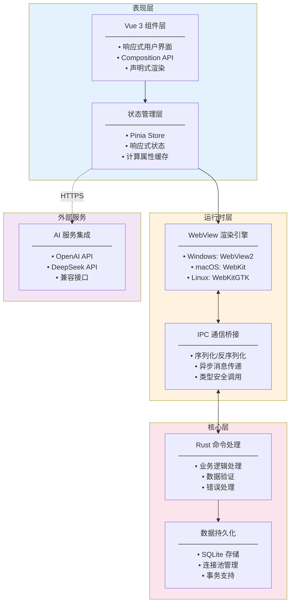
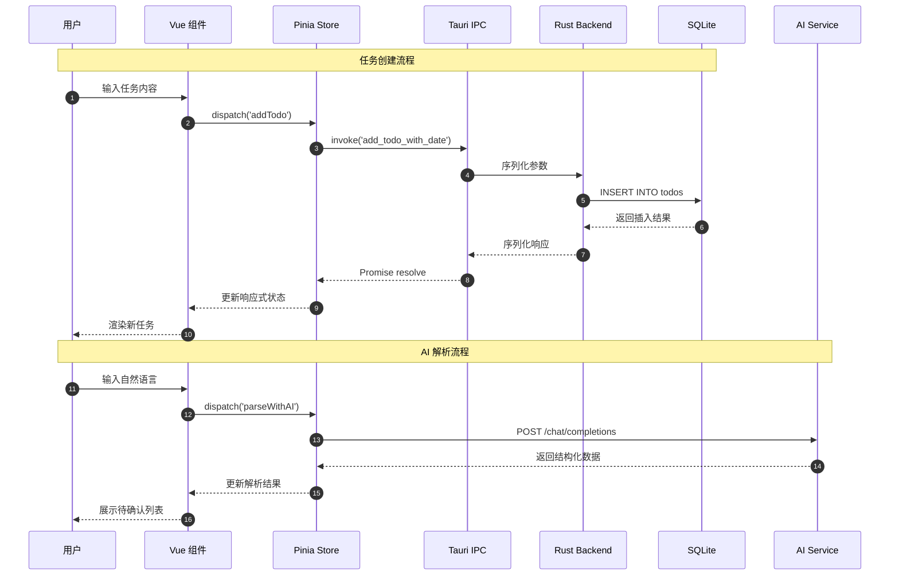
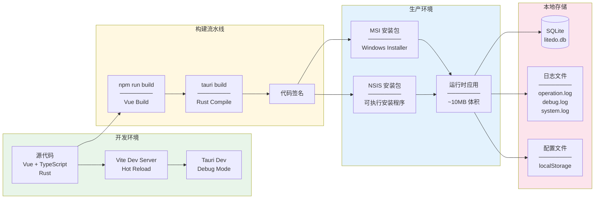
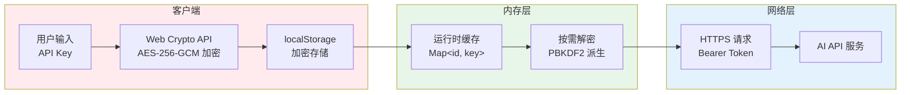

# LiteDo 系统架构文档

本文档详细阐述 LiteDo 项目的系统架构设计、技术选型依据及核心实现方案。

---

## 目录

- [系统架构](#系统架构)
- [技术说明](#技术说明)
- [安全设计](#安全设计)
- [性能优化](#性能优化)

---

## 系统架构

### 架构总览

LiteDo 采用**前后端分离**的混合架构模式，通过 Tauri 框架实现 Web 前端与 Rust 后端的高效协同。整体架构分为四个核心层次：



### 核心组件说明

| 层级 | 组件 | 职责 | 技术实现 |
|------|------|------|----------|
| **表现层** | Vue Components | 用户界面渲染与交互 | Vue 3 SFC + TypeScript |
| **表现层** | Pinia Store | 应用状态集中管理 | Pinia + Composition API |
| **运行时层** | WebView | 前端渲染引擎 | 系统原生 WebView |
| **运行时层** | IPC Bridge | 前后端通信桥梁 | Tauri invoke API |
| **核心层** | Rust Commands | 业务逻辑处理单元 | Tauri Command 宏 |
| **核心层** | SQLite | 本地数据持久化 | SQLx + SQLite |
| **外部服务** | AI API | 自然语言解析 | OpenAI Compatible API |

### 数据流架构



### 部署架构



---

## 技术说明

### 技术栈选型

#### 前端技术栈

| 技术 | 版本 | 选型依据 |
|------|------|----------|
| **Vue 3** | ^3.5.13 | 采用 Composition API，提供更优的 TypeScript 支持与代码组织能力。参考：[Vue 3 RFCs](https://github.com/vuejs/rfcs) |
| **TypeScript** | ~5.6.2 | 静态类型检查，提升代码可维护性与 IDE 支持。参考：[TypeScript Handbook](https://www.typescriptlang.org/docs/handbook/) |
| **Pinia** | ^3.0.4 | Vue 官方推荐的状态管理方案，相比 Vuex 具有更简洁的 API 与完整的 TypeScript 支持。参考：[Pinia Official Docs](https://pinia.vuejs.org/) |
| **Vite** | ^6.0.3 | 基于 ES Modules 的下一代构建工具，开发启动速度显著优于 Webpack。参考：[Vite Guide](https://vitejs.dev/guide/) |

#### 后端技术栈

| 技术 | 版本 | 选型依据 |
|------|------|----------|
| **Tauri 2.0** | ^2 | 相比 Electron，安装包体积减少 95%+（约 10MB vs 150MB+），内存占用降低 60%+。核心原理：使用系统原生 WebView 而非打包 Chromium。参考：[Tauri Architecture](https://tauri.app/v2/architecture/) |
| **Rust** | Edition 2021 | 内存安全保证，零成本抽象，适合系统级编程。参考：[The Rust Programming Language](https://doc.rust-lang.org/book/) |
| **SQLite** | - | 轻量级嵌入式数据库，无需独立服务进程，适合桌面应用场景。参考：[SQLite Documentation](https://www.sqlite.org/docs.html) |
| **SQLx** | ^0.8 | 编译时 SQL 验证，类型安全的异步 SQL 工具包。参考：[SQLx GitHub](https://github.com/launchbadge/sqlx) |
| **Tokio** | ^1 | Rust 异步运行时标准，提供高效的 I/O 多路复用。参考：[Tokio Tutorial](https://tokio.rs/tokio/tutorial) |

### 核心技术决策

#### 1. Tauri vs Electron 架构对比

| 维度 | Tauri | Electron |
|------|-------|----------|
| **渲染引擎** | 系统 WebView | 内置 Chromium |
| **安装包体积** | ~10MB | ~150MB |
| **内存占用** | ~50MB | ~150MB |
| **启动速度** | 快 | 中等 |
| **跨平台一致性** | 依赖系统 WebView | 完全一致 |
| **安全性** | Rust 内存安全 | Node.js 沙箱 |

**决策依据**：对于待办事项这类轻量级应用，Tauri 的资源效率优势显著，且 Rust 后端提供更强的安全保障。详见 [Tauri Security](https://tauri.app/v2/security/)。

#### 2. Vue 3 Composition API vs Options API

| 维度 | Composition API | Options API |
|------|-----------------|-------------|
| **TypeScript 支持** | 完整类型推断 | 需要额外配置 |
| **代码组织** | 按功能聚合 | 按选项分散 |
| **逻辑复用** | Composables | Mixins |
| **打包体积** | Tree-shaking 友好 | 全量引入 |

**决策依据**：Composition API 更适合复杂应用的代码组织和复用，且与 TypeScript 配合更佳。

#### 3. 数据库选型：SQLite vs 其他方案

| 方案 | 优点 | 缺点 |
|------|------|------|
| **SQLite** | 零配置、单文件、跨平台 | 并发写入受限 |
| **LevelDB** | 高性能键值存储 | 无 SQL 支持 |
| **JSON 文件** | 极简实现 | 无查询能力、易损坏 |

**决策依据**：SQLite 提供完整的 SQL 查询能力，单文件存储便于备份迁移，完美契合桌面应用场景。

---

## 安全设计

### 安全架构



### 数据加密方案

采用 **Web Crypto API** 实现 AES-256-GCM 加密算法：

```
加密流程：
1. 生成 16 字节随机盐值 (Salt)
2. 使用 PBKDF2 算法派生密钥 (100,000 次迭代)
3. 生成 12 字节初始化向量 (IV)
4. AES-GCM 加密明文数据
5. 组合存储：Salt + IV + Ciphertext
```

**安全性说明**：
- PBKDF2 迭代次数符合 [OWASP 建议](https://cheatsheetseries.owasp.org/cheatsheets/Password_Storage_Cheat_Sheet.html)（≥ 10,000 次）
- AES-GCM 提供认证加密，防止密文篡改攻击
- 每次加密使用随机 Salt 和 IV，防止密钥复用攻击

### 加密实现代码

```typescript
export async function encryptApiKey(plainText: string): Promise<string> {
  const encoder = new TextEncoder();
  const data = encoder.encode(plainText);
  const keyData = encoder.encode(ENCRYPTION_KEY);
  
  const key = await crypto.subtle.importKey(
    'raw', keyData, { name: 'PBKDF2' }, false, ['deriveBits', 'deriveKey']
  );
  
  const salt = crypto.getRandomValues(new Uint8Array(16));
  const derivedKey = await crypto.subtle.deriveKey(
    { name: 'PBKDF2', salt, iterations: 100000, hash: 'SHA-256' },
    key,
    { name: 'AES-GCM', length: 256 },
    false,
    ['encrypt']
  );
  
  const iv = crypto.getRandomValues(new Uint8Array(12));
  const encrypted = await crypto.subtle.encrypt(
    { name: 'AES-GCM', iv },
    derivedKey,
    data
  );
  
  const result = new Uint8Array(salt.length + iv.length + encrypted.byteLength);
  result.set(salt, 0);
  result.set(iv, salt.length);
  result.set(new Uint8Array(encrypted), salt.length + iv.length);
  
  return btoa(String.fromCharCode(...result));
}
```

---

## 性能优化

### 状态管理优化

采用 **Pinia + Composition API** 模式：

```typescript
const todos = shallowRef<Todo[]>([]);

const todoMap = computed(() => {
  const map = new Map<string, Todo>();
  for (const todo of todos.value) {
    map.set(todo.id, todo);
  }
  return map;
});
```

**优化策略**：

| 策略 | 说明 | 收益 |
|------|------|------|
| `shallowRef` | 浅层响应式 | 避免深层监听开销 |
| `computed` 缓存 | 自动缓存计算结果 | 避免重复计算 |
| `Map` 结构 | O(1) 查找复杂度 | 从 O(n) 优化至 O(1) |

### 数据库连接池管理

```rust
use once_cell::sync::OnceCell;
use sqlx::sqlite::{SqlitePool, SqlitePoolOptions};

static DB_POOL: OnceCell<SqlitePool> = OnceCell::new();

async fn get_db(app: &tauri::AppHandle) -> Result<SqlitePool, String> {
    if let Some(pool) = DB_POOL.get() {
        return Ok(pool.clone());
    }
    
    let pool = SqlitePoolOptions::new()
        .max_connections(5)
        .connect(&db_url)
        .await?;
    
    let _ = DB_POOL.set(pool.clone());
    Ok(pool)
}
```

**设计考量**：
- SQLite 作为嵌入式数据库，连接开销较小
- 连接池避免频繁创建/销毁连接
- 单例模式确保全局唯一连接池实例

### AI 集成方案

支持 OpenAI 兼容 API，实现多模型接入：

```typescript
interface ChatCompletionRequest {
  model: string;
  messages: ChatMessage[];
  temperature?: number;
  max_tokens?: number;
}

const PROVIDERS = {
  openai: 'https://api.openai.com/v1',
  deepseek: 'https://api.deepseek.com/v1',
  custom: 'user-defined-url'
};
```

**Prompt Engineering**：针对任务解析场景优化的系统提示词，支持：
- 任务自动拆分（识别并列任务）
- 优先级智能推断
- 内容精炼优化

---

## 相关文档

- [Vue 项目架构说明](./vue-architecture.md) - 前端架构详细说明
- [更新日志](../CHANGELOG.md) - 版本更新历史
- [README](../README.md) - 项目概述
